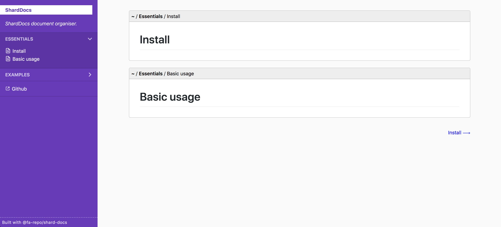

<div align="center">

# Shard Docs

A simple engine for organising and viewing docs written in JSX.

[![version][version-badge]][package] [![MIT License][license-badge]][license]

[**Read The Docs**](https://fa-repo.github.io/shard-docs/#/docs)
</div>

<hr/>





## Table of Contents

- [Install](#install)
- [Basic usage](#basic-usage)
- [API](#api)
- [Source schema](#source-schema)
- [Write docs with MDX](#write-docs-with-mdx)
- [License](#license)

## Install

This package relies on [react router](https://reacttraining.com/react-router/web/guides/quick-start) for routing.

```
npm install @fa-repo/shard-docs react-router-dom
```


## Basic usage

```jsx
// documentation.js
import React from "react";
import { render } from "react-dom";
import { HashRouter } from "react-router-dom";
import ShardDocs from "@fa-repo/shard-docs";
import "@fa-repo/shard-docs/dist/shard-docs.css";

const source = [
  { title: "Install", document: <><h1>Install</h1></> },
  { title: "Basic usage", document: <><h1>Basic usage</h1></> },
  {
    title: "Examples",
    children: [
      { title: "Use case A", document: <><h1>Use case A</h1></> },
      { title: "Use case B", document: <><h1>Use case B</h1></> }
    ]
  },
  { title: "Github", externalLink: "https://github.com" },
]

render(
  <HashRouter>
    <ShardDocs
      title="ShardDocs demo"
      description="A description describing the purpose of the docs."
      source={source}
    />
  </HashRouter>,
  document.getElementById("root")
);
```

## API
```jsx
<ShardDocs
  /**
   * Assign docs a title. Title appears at the top of the sidebar.
   * @string
   * @default ""
  */
  title="App title"
  /**
   * Describe intention of docs. Appears below the title.
   * @optional
   * @string
   * @default ""
  */
  description="App description"
  /**
   * Add a prefix to all routes. E.g. "/docs/".
   * @optional
   * @string
   * @default "/"
  */
  basePath="/docs/"
  /**
   * "Built with Shard Docs" is shown by default at the bottom of the sidebar. This option hides it.
   * @optional
   * @boolean
   * @default false
  */
  hideBuiltWithShardDocs={true}
  /**
   * Data is fed in through the source prop. Scroll down for an explanation of the schema.
   * @array
   * @default []
  */
  source={[
    {
      title: "Essentials",
      children: [
        { title: "Get started", document: <p>Lorem ipsum dolor sit amet..</p> }
      ]
    }
  ]}
/>
```

## Source schema
The input source value is made up of a variety of items that affect how the sidebar menu is rendered and the paths to documents and folders are generated.

Each item has a common `title` property. The combination of the subsequent properties defines their types.

##### Let's take a look at the different items:

`document`:  Represents a document endpoint.
```jsx
  {
    /**
     * Document title
     * @string
    */
    title: "Install",
    /**
     * Document content
     * @jsx
    */
    document: <h1>Install</h1>
  }
```

`folder`: Contains any array with any number of items.
```jsx
  {
    /**
     * Folder title.
     * @optional
     * @string
    */
    title: "Install",
    /**
     * Folder items. Can contain any type of node.
     * @array
    */
    children: [ /* items */ ]
  }
```

`externalLink`: A link that opens in a new tab.
```jsx
  {
    /**
     * Link title.
     * @string
    */
    title: "Github",
    /**
     * Link href.
     * @string
    */
    externalLink: "http://www.github.com"
  }
```


## Write docs with MDX
Documents are composed from JSX which offers a lot of power but the syntax can get unwieldy. MDX makes writing docs a breaze by combining the syntaxes of JSX and markdown. Setting up [mdx-js](https://github.com/mdx-js/mdx) will enabled this feature. Totally recommended!


**JSX:**
```jsx
<>
  <h1>Title</h1>
  <p>Lorem ipsum dolor sit amet, consetetur sadipscing elitr, sed diam nonumy eirmod tempor invidunt ut
  labore et dolore magna aliquyam erat, sed diam voluptua. At vero eos et accusam et justo duo dolores
  et ea rebum. Stet clita kasd gubergren, no sea takimata sanctus est Lorem ipsum dolor sit amet.</p>
  <h2>Examples</h2>
  <h3>Hello world</h3>
  <Example sourceCode={`/* example source code*/`}>
    <App>
  </Example>
</>
```
**MDX:**
```mdx
# Title

Lorem ipsum dolor sit amet, consetetur sadipscing elitr, sed diam nonumy eirmod tempor invidunt ut
labore et dolore magna aliquyam erat, sed diam voluptua. At vero eos et accusam et justo duo dolores
et ea rebum. Stet clita kasd gubergren, no sea takimata sanctus est Lorem ipsum dolor sit amet.

## Examples

### Hello world

<Example sourceCode={`/* example source code*/`}>
  <App>
</Example>
```

## License
[MIT](https://choosealicense.com/licenses/mit/)

[version-badge]: https://img.shields.io/npm/v/@fa-repo/shard-docs.svg?style=flat-square
[license-badge]: https://img.shields.io/npm/l/@testing-library/react.svg?style=flat-square
[package]: https://www.npmjs.com/package/@fa-repo/shard-docs
[license]: https://github.com/fa-repo/shard-docs/blob/master/LICENSE.md