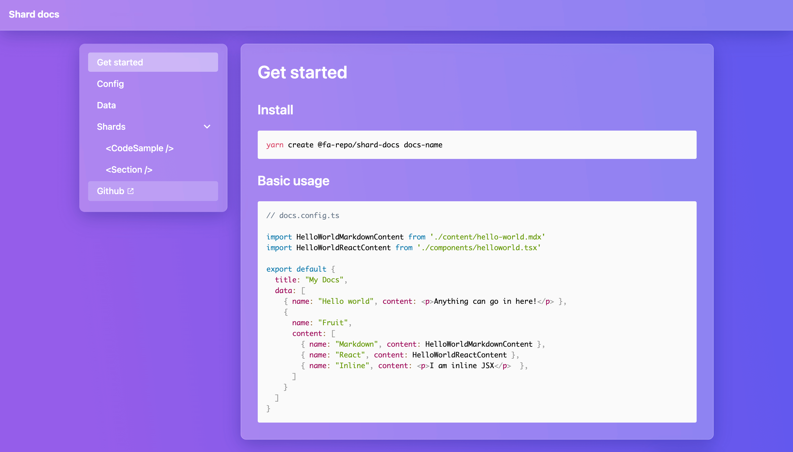

# shard-docs

A concise / extendable react component for handling documentation

[](https://www.npmjs.com/package/@fa-repo/shard-docs) [](https://standardjs.com)

## Install
```bash
npm install --save @fa-repo/shard-docs
```

## Usage
```jsx
ReactDOM.render(
  <ShardDocs
    title="Documentation title"
    structure={[
      { type: "heading", heading: "Essentials" },
      {
        type: "page",
        title: "Get started",
        composition: [
          <>
            <h1>Get started</h1>
            <p>
              Lorem ipsum dolor sit amet, consectetuer adipiscing elit. Phasellus hendrerit.
              Pellentesque aliquet nibh nec urna. In nisi neque, aliquet vel, dapibus id, mattis
              vel, nisi. Sed pretium, ligula sollicitudin laoreet viverra, tortor libero sodales
              leo, eget blandit nunc tortor eu nibh. Nullam mollis. Ut justo. Suspendisse potenti.
              Sed egestas, ante et vulputate volutpat, eros pede semper est, vitae luctus metus
              libero eu augue. Morbi purus libero, faucibus adipiscing, commodo quis, gravida id,
              est. Sed lectus. Praesent elementum hendrerit tortor. Sed semper lorem at felis.
              Vestibulum volutpat, lacus a ultrices sagittis, mi neque euismod dui, eu pulvinar nunc
              sapien ornare nisl. Phasellus pede arcu, dapibus eu.
            </p>
          </>
        ]
      }
    ]}
  />,
    document.getElementById('app')
);
```



## Docs / examples
Discover api and use cases [here](https://fa-repo.github.io/shard-docs/#/docs).

## License
[MIT](https://choosealicense.com/licenses/mit/)